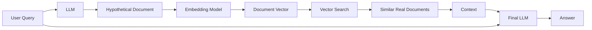
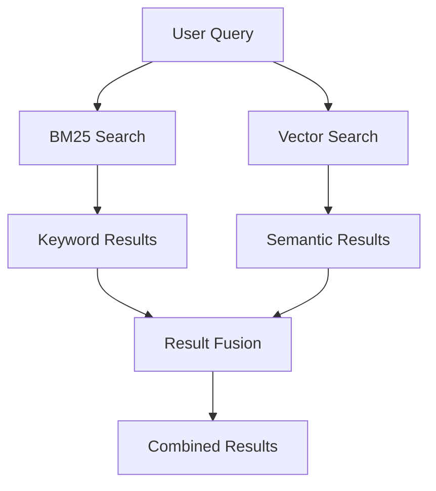
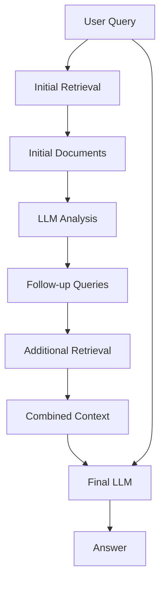

# Advanced RAG Techniques and Optimizations

This document covers cutting-edge techniques, optimizations, and advanced implementations for Retrieval Augmented Generation (RAG) systems. It's designed for those who already understand the [basic RAG concepts](./concepts.md) and want to explore more sophisticated approaches.

> 📚 **Learning Path**: This document is part of a three-part learning progression:
>
> 1. [README.md](./README.md): Practical guide for setup and usage
> 2. [concepts.md](./concepts.md): Core RAG concepts and component explanations
> 3. **advanced_concepts.md (this file)**: Advanced techniques and optimizations

## 1. Advanced Retrieval Techniques

### Hypothetical Document Embeddings (HyDE)

HyDE is an approach that uses the LLM to generate a hypothetical document that would answer the query, then uses that document's embedding (rather than the query's embedding) for retrieval.



**Why It Works**: Query embeddings often lack the specificity and context needed for optimal retrieval. By having the LLM generate a hypothetical answer first, we get a richer representation containing the kinds of details and language that would likely appear in a good source document.

**Sample Implementation**:

```python
from langchain.retrievers import HypotheticalDocumentEmbedder
from langchain_openai import ChatOpenAI

# Base retriever
base_retriever = vectorstore.as_retriever()

# LLM for generating hypothetical documents
llm = ChatOpenAI(temperature=0)

# Create the HyDE retriever
hyde_retriever = HypotheticalDocumentEmbedder.from_llm(
    llm=llm,
    base_retriever=base_retriever,
    prompt_template="""Given this question, generate a hypothetical document that would answer it:
    Question: {question}
    Hypothetical document:"""
)

# Using the HyDE retriever
documents = hyde_retriever.get_relevant_documents(
    "What are the rules of the Continental Hotel in John Wick?"
)
```

### Query Transformation

Query transformation involves modifying the original query to improve retrieval performance. This can include:

1. **Query Expansion**: Adding related terms or synonyms
2. **Query Rewriting**: Rephrasing for clarity or completeness
3. **Query Decomposition**: Breaking complex queries into simpler sub-queries

**Implementation Example**:

```python
from langchain.retrievers.query_transformation import PromptQueryTransformation
from langchain.schema.runnable import RunnablePassthrough

# Create a query transformer
query_transformer = PromptQueryTransformation(
    llm=ChatOpenAI(),
    template="""You are an expert at transforming user questions into the most effective search queries. 
    Transform the following user question into a search query that will help find the most relevant documents:
    User question: {query}
    Search query:"""
)

# Create the transformed retrieval chain
transformed_retrieval_chain = (
    {"query": RunnablePassthrough()} 
    | {"transformed_query": query_transformer, "original_query": lambda x: x["query"]}
    | {"documents": lambda x: vectorstore.similarity_search(x["transformed_query"]), "query": lambda x: x["original_query"]}
)

# Using the transformed retrieval chain
result = transformed_retrieval_chain.invoke({"query": "Why is John Wick so angry about his dog?"})
```

### Self-Query Retriever

Self-query retrievers use an LLM to parse a natural language query into both a search query and structured filters, enabling more precise retrieval.

```python
from langchain.retrievers.self_query import SelfQueryRetriever
from langchain.chains.query_constructor.base import AttributeInfo

# Define metadata fields and their types
metadata_field_info = [
    AttributeInfo(
        name="Movie_Title",
        description="The title of the John Wick movie being reviewed",
        type="string",
    ),
    AttributeInfo(
        name="Rating",
        description="The numerical rating given to the movie (1-10)",
        type="integer",
    ),
]

# Create the self-query retriever
self_querying_retriever = SelfQueryRetriever.from_llm(
    llm=ChatOpenAI(),
    vectorstore=vectorstore,
    document_contents="John Wick movie reviews",
    metadata_field_info=metadata_field_info,
)

# Example query combining search and filters
documents = self_querying_retriever.get_relevant_documents(
    "What do reviews with ratings above 8 say about John Wick 3's action scenes?"
)
```

## 2. Advanced Vector Search Techniques

### Hybrid Search

Hybrid search combines the strengths of sparse retrieval (keyword-based like BM25) and dense retrieval (embedding-based semantic search).



**Implementation**:

```python
from langchain.retrievers import BM25Retriever, EnsembleRetriever
from langchain.retrievers.ensemble import WeightedEnsembleRetriever

# Create the keyword retriever
bm25_retriever = BM25Retriever.from_documents(documents)

# Create the semantic retriever
vector_retriever = vectorstore.as_retriever()

# Create the weighted ensemble hybrid retriever
hybrid_retriever = WeightedEnsembleRetriever(
    retrievers=[bm25_retriever, vector_retriever],
    weights=[0.3, 0.7],  # Weights should sum to 1
    verbose=True
)

# Get results
hybrid_docs = hybrid_retriever.get_relevant_documents("Continental Hotel gold coins")
```

### Cross-Encoder Reranking

Cross-encoders analyze query and document pairs together rather than separately, providing more accurate relevance scoring but at higher computational cost. They're often used to rerank an initial set of retrieved documents.

```python
from langchain.retrievers import ContextualCompressionRetriever
from langchain_community.retrievers.document_compressors import CohereRerank
from langchain_openai import OpenAIEmbeddings

# Create base retriever that gets a larger initial set
base_retriever = vectorstore.as_retriever(search_kwargs={"k": 20})

# Create the cross-encoder reranker
reranker = CohereRerank()

# Create the compression retriever
compression_retriever = ContextualCompressionRetriever(
    base_retriever=base_retriever,
    compressor=reranker,
    top_k=5  # Return top 5 after reranking
)

# Get more precisely ranked results
documents = compression_retriever.get_relevant_documents("Who is Winston in John Wick?")
```

### Vector Search with Maximum Marginal Relevance (MMR)

MMR balances relevance with diversity in the results, ensuring that the retrieved documents cover different aspects of the query.

```python
# Using MMR instead of similarity search
diverse_docs = vectorstore.max_marginal_relevance_search(
    query="What are the main themes in John Wick?",
    k=5,  # Return 5 documents
    fetch_k=15,  # Fetch 15 initial candidates
    lambda_mult=0.5  # Diversity vs relevance tradeoff (0-1)
)
```

## 3. Advanced RAG Architectures

### Recursive Retrieval RAG

Recursive retrieval uses the initial retrieval results to fuel additional retrieval steps, iteratively refining the context.



**Implementation**:

```python
from langchain.chains import create_retrieval_chain
from langchain.chains.combine_documents import create_stuff_documents_chain

# Create document chain for initial query
document_chain = create_stuff_documents_chain(llm, prompt)

# Define a recursive retrieval chain
recursive_chain = create_retrieval_chain(
    retriever, 
    document_chain,
    # Define how to handle the recursive aspect
    callbacks=[recursive_analyzer]
)

# Use the recursive retriever
result = recursive_chain.invoke({"input": "Explain how the High Table works in John Wick."})
```

### Agent-Based RAG

Agent-based RAG systems use an LLM to decide which retrieval actions to take, what queries to run, or how to filter results, effectively acting as a "research agent" that strategically gathers information.

```python
from langchain.agents import create_react_agent, AgentExecutor
from langchain.tools import Tool

# Create tools the agent can use
retrieval_tool = Tool(
    name="JohnWickRetriever",
    func=vectorstore.similarity_search,
    description="Search for information in the John Wick reviews database. Input should be a search query."
)

filter_tool = Tool(
    name="FilterByRating",
    func=lambda x: filter_by_rating(documents, int(x)),
    description="Filter documents by minimum rating (1-10). Input should be a number."
)

# Create the agent with access to tools
react_agent = create_react_agent(
    llm=ChatOpenAI(temperature=0),
    tools=[retrieval_tool, filter_tool],
    prompt=agent_prompt
)

# Create the agent executor
agent_executor = AgentExecutor(
    agent=react_agent,
    tools=[retrieval_tool, filter_tool],
    verbose=True
)

# Run the agent
result = agent_executor.invoke(
    {"input": "What do the most positive reviews say about Keanu Reeves in John Wick 3?"}
)
```

### Multi-Index RAG

Multi-index RAG involves querying multiple vector stores, each containing different types of content or structured differently, then combining the results.

```python
from langchain.retrievers import MultiVectorRetriever
from langchain_community.storage import InMemoryStore

# Parent documents store
docstore = InMemoryStore()

# Create retrievers for different indexes
reviews_retriever = reviews_vectorstore.as_retriever(search_kwargs={"k": 3})
plots_retriever = plots_vectorstore.as_retriever(search_kwargs={"k": 2})
character_retriever = character_vectorstore.as_retriever(search_kwargs={"k": 2})

# Combine results with custom logic
def retrieve_from_multiple(query):
    review_docs = reviews_retriever.get_relevant_documents(query)
    plot_docs = plots_retriever.get_relevant_documents(query)
    character_docs = character_retriever.get_relevant_documents(query)
    
    # Custom merging logic - could use various ranking methods
    all_docs = review_docs + plot_docs + character_docs
    return all_docs[:5]  # Return top 5 combined results

# Use the multi-index retriever
results = retrieve_from_multiple("What is John Wick's motivation in the second film?")
```

## 4. Advanced Context Processing

### Document Compressors

Document compressors reduce the size of retrieved documents before sending them to the LLM, either by filtering out irrelevant sections or summarizing content.

```python
from langchain.retrievers.document_compressors import LLMChainExtractor

# Create a document compressor that extracts only relevant information
compressor = LLMChainExtractor.from_llm(llm)

# Apply compression to documents
compressed_docs = []
for doc in documents:
    compressed = compressor.compress_documents(
        [doc],
        query="What are the action scenes like in John Wick?"
    )
    compressed_docs.extend(compressed)
```

### Token Windowing

Token windowing helps manage context limits by dynamically sliding a window through large documents to find the most relevant sections.

```python
from langchain.retrievers import ContextualCompressionRetriever
from langchain.retrievers.document_compressors import DocumentWindower

# Create a document windower
windower = DocumentWindower(
    token_window_size=300,  # Size of each window
    token_overlap=50,  # Overlap between windows
    window_type="token"  # Window by tokens rather than characters
)

# Create a compression retriever with the windower
window_retriever = ContextualCompressionRetriever(
    base_retriever=base_retriever,
    compressor=windower
)

# Get documents with dynamic windowing
windowed_docs = window_retriever.get_relevant_documents("What happens in the catacombs scene?")
```

## 5. RAG Evaluation and Optimization

### RAG Evaluation Metrics

Properly evaluating RAG systems involves multiple dimensions:

1. **Retrieval Accuracy**: How well the retriever finds relevant documents
2. **Answer Relevance**: How well the answer addresses the question
3. **Answer Groundedness**: How well the answer is supported by the retrieved context
4. **Answer Completeness**: Whether the answer includes all necessary information

**Implementation Using RAGAS**:

```python
from ragas import evaluate
from ragas.metrics import (
    answer_relevancy,
    faithfulness,
    context_recall,
    context_precision
)

# Define evaluation data
eval_data = [
    {
        "question": "How does John Wick kill the assassin in the library?",
        "retrieved_contexts": [...],  # List of retrieved documents
        "generated_answer": "John Wick kills the assassin in the library using a book.",
        "ground_truth": "John Wick uses a hardcover book to kill the assassin in the library."
    }
    # More evaluation examples...
]

# Run evaluation
result = evaluate(
    eval_data,
    metrics=[answer_relevancy, faithfulness, context_recall, context_precision]
)

print(f"Answer Relevancy: {result['answer_relevancy']}")
print(f"Faithfulness: {result['faithfulness']}")
print(f"Context Recall: {result['context_recall']}")
print(f"Context Precision: {result['context_precision']}")
```

### Fine-Tuning for RAG

Fine-tuning embedding models specifically for retrieval can significantly improve RAG performance:

```python
from sentence_transformers import SentenceTransformer, InputExample, losses
from torch.utils.data import DataLoader

# Prepare training data (query-document pairs with relevance labels)
train_examples = [
    InputExample(
        texts=["Who is John Wick?", "John Wick is a legendary hitman known as Baba Yaga."],
        label=1.0  # Relevant
    ),
    InputExample(
        texts=["Who is John Wick?", "The Continental Hotel has a strict no-killing policy."],
        label=0.0  # Not relevant
    )
    # More examples...
]

# Create a dataloader
train_dataloader = DataLoader(train_examples, shuffle=True, batch_size=16)

# Load base model
model = SentenceTransformer('all-mpnet-base-v2')

# Define loss function
train_loss = losses.CosineSimilarityLoss(model)

# Train the model
model.fit(
    train_objectives=[(train_dataloader, train_loss)],
    epochs=3,
    warmup_steps=100
)

# Save the fine-tuned model
model.save('john-wick-retrieval-model')
```

## 6. Production Considerations

### Scalable Vector Stores

For production RAG systems, in-memory vector stores should be replaced with scalable solutions:

```python
from langchain_qdrant import QdrantVectorStore
from qdrant_client import QdrantClient

# Connect to a persistent Qdrant instance
client = QdrantClient(
    url="https://your-qdrant-instance-url:6333",
    api_key="your_api_key"
)

# Create a vector store using the client
vectorstore = QdrantVectorStore(
    client=client,
    collection_name="john_wick_reviews",
    embedding=embeddings
)
```

### Caching for Performance

Implement caching to avoid redundant computation:

```python
from langchain.cache import InMemoryCache
import langchain

# Set up global cache
langchain.llm_cache = InMemoryCache()

# For embedding cache
from langchain.cache import RedisSemanticCache
import redis

# Set up Redis for embedding cache
redis_client = redis.Redis.from_url("redis://localhost:6379")
langchain.embedding_cache = RedisSemanticCache(redis_client=redis_client, namespace="embeddings")
```

### Query Streaming

For better user experience, implement streaming responses:

```python
from langchain_core.runnables import RunnableConfig
from langchain_core.output_parsers import StrOutputParser
import asyncio

# Create a streaming chain
streaming_chain = retriever | prompt | llm | StrOutputParser()

# Function to process streaming output
async def stream_response(query):
    async for chunk in streaming_chain.astream(
        {"question": query},
        config=RunnableConfig(tags=["streaming-demo"])
    ):
        # In a real app, you'd send these chunks to the frontend
        print(chunk, end="", flush=True)
        await asyncio.sleep(0.01)  # Just for demonstration

# Use the streaming function
await stream_response("What are the most impressive action scenes in John Wick?")
```

## Advanced Implementation Projects

To truly master advanced RAG techniques, try implementing these challenging projects:

### 1. Multi-Modal RAG System

Extend the system to handle both text and images, allowing queries about visual elements in John Wick films.

### 2. Conversational RAG Agent

Create a conversation system that maintains history and can answer follow-up questions using previously retrieved context.

### 3. RAG with Tool Augmentation

Implement a system that can not only retrieve information but also use tools (like calculators, web search) to enhance responses.

### 4. RAG-Augmented Fine-Tuning

Collect RAG-generated responses to common queries, then fine-tune a smaller model on this data to create a more efficient specialized model.

## References and Further Reading

1. Lewis, P., et al. (2020). [Retrieval-Augmented Generation for Knowledge-Intensive NLP Tasks](https://arxiv.org/abs/2005.11401)
2. Gao, L., et al. (2023). [Precise Zero-Shot Dense Retrieval without Relevance Labels](https://arxiv.org/abs/2212.10496) (HyDE)
3. Asai, A., et al. (2023). [Self-RAG: Learning to Retrieve, Generate, and Critique through Self-Reflection](https://arxiv.org/abs/2310.11511)
4. Li, B., et al. (2022). [Making Retrieval-Augmented Language Models More Reliable](https://arxiv.org/abs/2301.00303)
5. Peng, B., et al. (2023). [RARR: Researching and Revising What Language Models Say](https://arxiv.org/abs/2301.07295)
